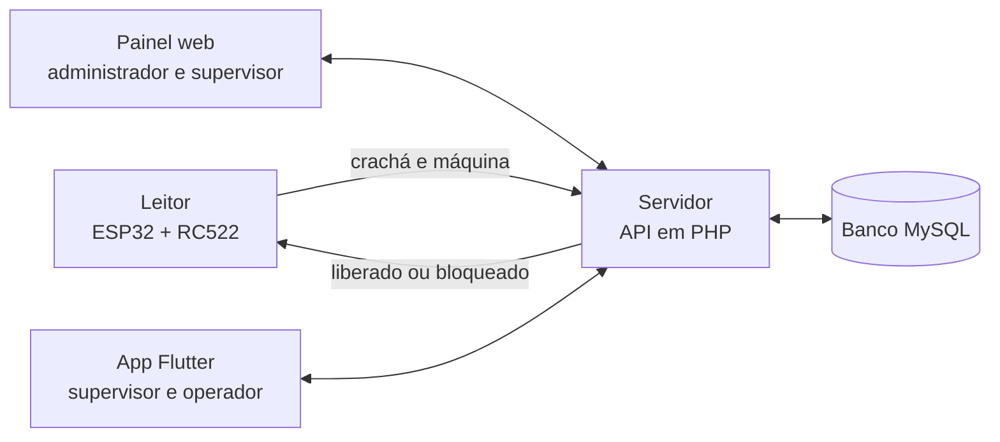

# Plano da apresentação do LockMachine

Rascunho de 09/10/2026 para o grupo validar. Parte do que está em [estrategia.md](estrategia.md): o maior risco do projeto é chegar à banca sem prova de que a regra funciona fora do navegador.

## Conclusão

No dia, a banca vê o caminho inteiro funcionando de verdade, com um crachá na mão:

> O administrador cadastra um funcionário e uma máquina no painel. O funcionário encosta o crachá no leitor. O leitor acende verde ou vermelho. A tentativa aparece na hora no painel e no celular do supervisor.

São quatro peças (leitor, servidor, painel e app) e todas falam com o mesmo servidor. Com 1 a 2 meses de prazo dá para fazer, desde que cada peça fique no mínimo descrito aqui.

## O que a banca vai ver

Roteiro de uns 7 minutos. Cada passo mostra uma peça.

| # | O que acontece | Peça em destaque |
| --- | --- | --- |
| 1 | O problema: a máquina não sabe quem está na frente dela | Site (placa "Proibido") |
| 2 | O administrador entra no painel, cadastra uma máquina e um funcionário e registra o crachá dele | Painel web |
| 3 | Funcionário capacitado encosta o crachá: luz verde e a "máquina" liga | Leitor |
| 4 | Funcionário com capacitação vencida encosta o crachá: luz vermelha, bipe e a "máquina" não liga | Leitor |
| 5 | As duas tentativas aparecem no painel e no celular do supervisor, com o motivo do bloqueio | Painel e app |
| 6 | O operador abre o app e vê que a capacitação dele vence em poucos dias | App |
| 7 | O que é protótipo e o que viria depois | Site |

A "máquina" pode ser uma lâmpada ou uma ventoinha ligada por um relé: o importante é algo ligar e desligar na frente da banca.

## As quatro peças



A regra de acesso fica em um lugar só, no servidor. O leitor não decide nada: ele pergunta e obedece. É a mesma regra que hoje está em `checkAccess`, no `lockmachine_app/script.js`.

## Decisões já tomadas (09/10/2026)

| Decisão | Por quê |
| --- | --- |
| Servidor em **PHP + MySQL**, rodando no XAMPP | É o que o grupo aprendeu, então todos conseguem explicar à banca. Já está instalado nos computadores do SENAI e roda sem internet. Sem framework, para não ficar complexo |
| Leitor com **ESP32 + módulo RFID RC522** | O ESP32 tem Wi-Fi embutido e é a placa das aulas de IoT. O RC522 é o leitor mais comum e já vem com cartões |
| App **Flutter para Android** com dois perfis | Supervisor acompanha tentativas e máquinas; operador consulta as próprias capacitações |
| Painel e app **perguntam ao servidor a cada 2 ou 3 segundos** | Parece "ao vivo" na demonstração e é muito mais simples do que conexão permanente |
| Prazo de **1 a 2 meses**, em semanas de trabalho | Cada semana termina com algo que dá para mostrar |

## O mínimo de cada peça

O que não está nesta lista fica para depois da banca.

**Leitor (ESP32)**
- Lê o número do crachá e manda para o servidor junto com o código da máquina.
- Acende verde ou vermelho, toca o bipe e aciona o relé conforme a resposta.
- Mostra erro (pisca amarelo) quando não consegue falar com o servidor: nesse caso a máquina fica bloqueada.

**Servidor e banco**
- Login com três perfis: administrador, supervisor e operador.
- Cadastro de funcionários, máquinas e capacitações, com a validade de cada capacitação.
- Verificação do crachá, com o motivo: válida, vencendo, vencida, sem capacitação ou crachá desconhecido.
- Registro de toda tentativa.

**Painel web**
- Login de verdade no lugar do demonstrativo.
- Telas "Funcionários" e "Máquinas" (hoje "Em breve"), só para o administrador: listar, cadastrar, editar e desativar.
- Registrar crachá: o administrador encosta o crachá novo no leitor e clica em "Usar o último crachá lido".
- "Visão geral" com dados do banco: totais do dia, últimas tentativas e situação das máquinas.

**App Flutter**
- Login.
- Supervisor: tentativas ao vivo, situação das máquinas e aviso na tela quando há bloqueio.
- Operador: minhas capacitações, com validade e alerta de vencimento.

**Fica de fora:** recuperação de senha, relatórios, notificação com o app fechado, vários leitores ao mesmo tempo, publicação em loja e na internet.

## Banco: proposta inicial (para o João refinar)

| Tabela | Guarda |
| --- | --- |
| `funcionarios` | nome, matrícula, e-mail, senha (cifrada), perfil, número do crachá, ativo |
| `capacitacoes` | nome da capacitação (ex.: operação de prensas) |
| `funcionario_capacitacao` | qual funcionário tem qual capacitação e até quando vale |
| `maquinas` | código, nome, setor, capacitação exigida, situação, chave do leitor |
| `tentativas` | crachá lido, funcionário, máquina, resultado, motivo, data e hora |
| `sessoes` | quem está logado no painel ou no app |

## Servidor: proposta inicial (para o Cauê refinar)

| Rota | Quem usa | Faz |
| --- | --- | --- |
| `POST /api/login` | painel e app | confere e-mail e senha, devolve o perfil |
| `/api/funcionarios`, `/api/maquinas`, `/api/capacitacoes` | administrador | listar, cadastrar, editar, desativar |
| `POST /api/verificar` | leitor | recebe crachá e máquina, aplica a regra, registra a tentativa, responde liberado ou bloqueado |
| `GET /api/tentativas` | supervisor | últimas tentativas |
| `GET /api/resumo` | supervisor | totais do dia e situação das máquinas |
| `GET /api/minhas-capacitacoes` | operador | capacitações e validades de quem está logado |
| `GET /api/ultimo-cracha` | administrador | último crachá desconhecido lido, para o cadastro |

Tudo em JSON. Fechar esse contrato na primeira semana é o que deixa painel, app e leitor avançarem ao mesmo tempo.

## Quem faz o quê

| Pessoa | Entrega |
| --- | --- |
| **João** (banco de dados) | Diagrama do banco, `database/schema.sql`, dados de teste iguais aos do simulador (Marina, Carlos e Pedro; Prensa 01, Torno 03 e Fresa 02) e as consultas do resumo |
| **Cauê** (Scrum Master e back-end) | A API em PHP, com a regra de acesso; organizar as semanas e a reunião rápida do grupo |
| **Evelyn** (front-end) | Telas "Funcionários", "Máquinas" e formulários do painel em HTML e CSS, seguindo o [DESIGN.md](../DESIGN.md); fotos novas da equipe |
| **Leonardo** (PO e full stack) | Ligar o painel à API, fazer o app Flutter, juntar as peças e decidir o que entra e o que sai |
| **Miranda** (documentação) | Requisitos, casos de uso, dicionário de dados, manual de montagem do leitor, slides e roteiro; conferir a NR-12 com o orientador |
| **Dupla do leitor** (a definir) | Montagem do ESP32, código do leitor e a "máquina" de demonstração |

## Semanas

Proposta a partir de segunda, 12/10/2026. Se a data da banca for antes, corta-se pelo fim da lista de cortes abaixo.

| Semana | Banco e servidor | Painel | App | Leitor |
| --- | --- | --- | --- | --- |
| 1 (12/10) | Diagrama e contrato das rotas fechados | Desenho das telas novas | Projeto criado, tela de login | Comprar peças; testar a rede |
| 2 (19/10) | Banco criado; login e cadastros | Telas de cadastro em HTML | Login funcionando | Lê o crachá e mostra o número |
| 3 (26/10) | Verificação e registro de tentativas | Cadastro gravando no banco | Tela do supervisor | Fala com o servidor e acende a luz |
| 4 (02/11) | Resumo do dia | Visão geral com dados reais | Tela do operador | Relé, bipe e caixa |
| 5 (09/11) | Correções | Correções | Correções | Primeiro ensaio completo, na rede do dia |
| 6 (16/11) | Folga | Folga | Folga | Vídeo de reserva e ensaio final |

**Ordem dos cortes, se o tempo apertar:** tela do operador no app, gráfico de tentativas por hora com dados reais, edição de cadastro (fica só criar e desativar), caixa do leitor.

## O que pode dar errado no dia

| Risco | O que fazer |
| --- | --- |
| A rede do SENAI não deixa o leitor e o celular falarem com o notebook | Levar um roteador próprio ou usar o celular como roteador. **Testar na semana 1** se outro aparelho consegue abrir o servidor do notebook; se o notebook do SENAI bloquear, usar um notebook pessoal |
| O leitor falha na hora | Botão "Simular leitura" no painel, que chama a mesma rota do leitor. Peças sobressalentes: um ESP32 e um RC522 a mais |
| Tudo falha | Vídeo gravado do fluxo completo, feito na semana 6 |
| Perguntam "e se emprestarem o crachá?" ou "e se o sistema cair?" | Respostas ensaiadas e escritas (ver [estrategia.md](estrategia.md)). Sem servidor, o leitor mantém a máquina bloqueada |

## Lista de compras

| Item | Quantidade | Observação |
| --- | --- | --- |
| ESP32 (placa de desenvolvimento) | 2 | Um de reserva. Ver se o SENAI empresta |
| Módulo RFID RC522 com cartão e chaveiro | 2 | Funciona em 3,3 V, igual ao ESP32 |
| Cartões ou chaveiros RFID de 13,56 MHz a mais | 3 | Um por funcionário da demonstração |
| LED verde, LED vermelho, LED amarelo e resistores de 220 Ω | 1 jogo | |
| Buzzer ativo de 5 V | 1 | |
| Módulo relé de 1 canal | 1 | Liga a "máquina" |
| Lâmpada ou ventoinha pequena | 1 | Faz o papel da máquina |
| Protoboard, jumpers e cabo USB | 1 jogo | |

## Onde fica cada coisa no repositório

```text
database/                    schema.sql e dados de teste      (João)
api/                         servidor em PHP                  (Cauê)
firmware/                    código do ESP32                  (dupla do leitor)
app/                         projeto Flutter                  (Leonardo)
linkwave-tcc-reformulado/    site e painel                    (Evelyn e Leonardo)
docs/                        documentação                     (Miranda)
```

Cada um trabalha na sua pasta e na sua branch, e o Leonardo junta na `main`.

## Honestidade no site

Hoje o site diz que não existe leitor, banco nem servidor. Isso continua verdade até cada peça funcionar. Quando uma peça ficar pronta, atualizar o [PRODUCT.md](../PRODUCT.md), o README e os avisos amarelos do site, e continuar chamando de protótipo o que é protótipo.

## A decisão é de vocês

1. A data da banca, para ajustar as semanas.
2. Quem forma a dupla do leitor.
3. O que faz o papel da máquina: lâmpada, ventoinha ou outra coisa.
4. Qual notebook será o servidor no dia e que rede será usada.
5. Se o administrador e o supervisor são a mesma pessoa na demonstração.
